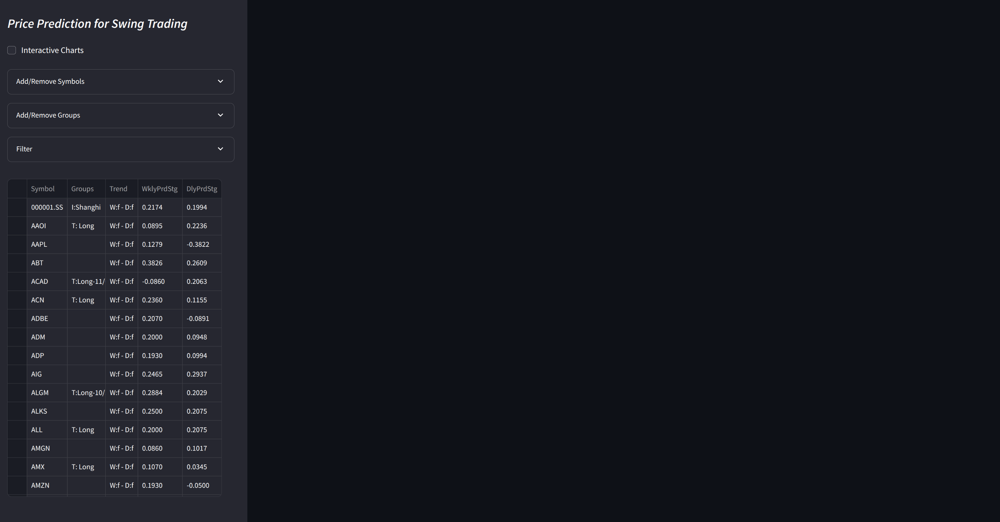
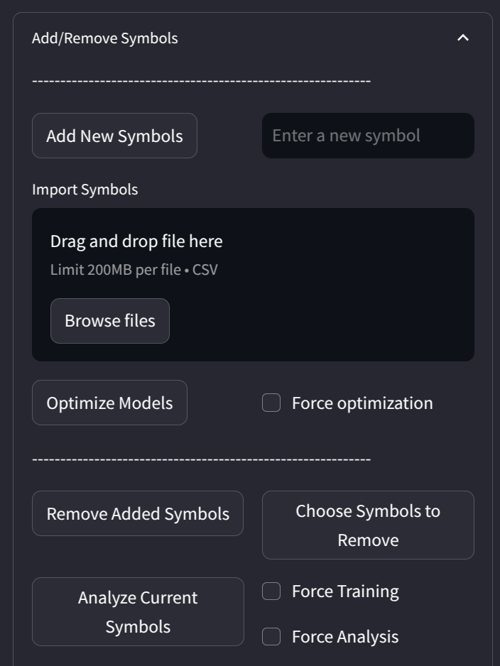
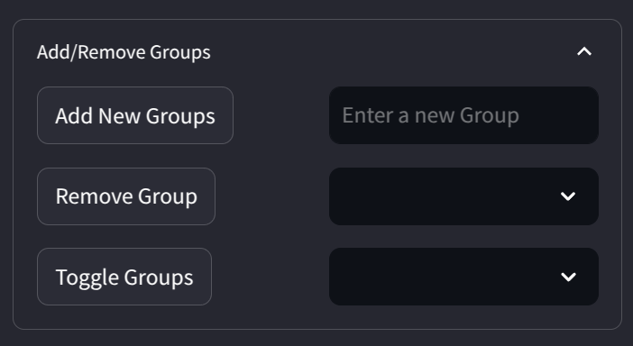
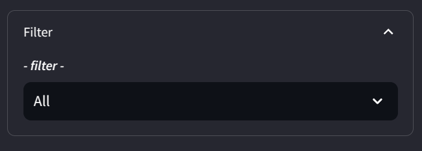
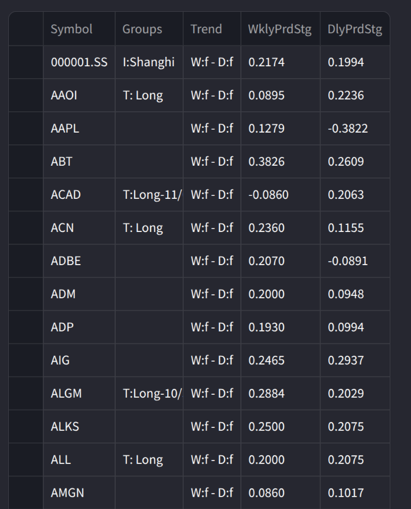
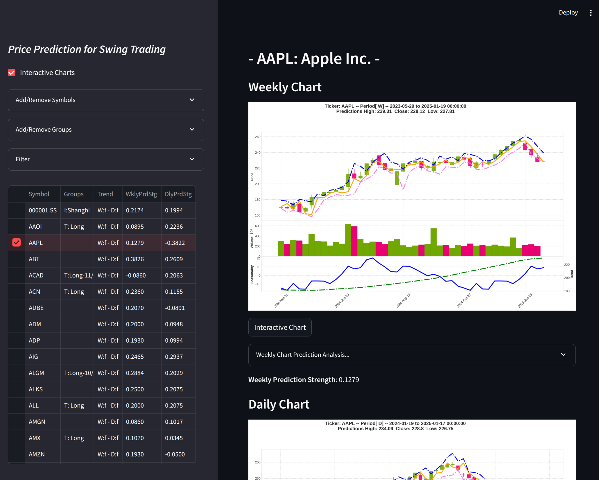
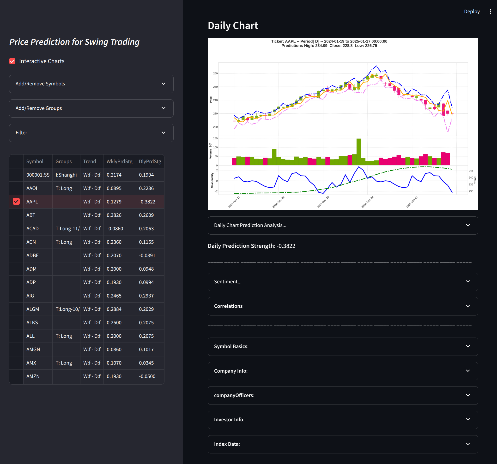

# ML Price Prediction - Swing Trading System

## Introduction

This is an ML Based Price Prediction Swing Trading System.
- Data is pulled from Yahoo Finance.
- A model is created for each Symbol/Ticker.
- The ML model generates Price Predictions and the deltas of price predictions is applied to the prior close.

This application is a web-based UI for a stock price prediction model. Here's a high-level overview of how it works:

1. User Interface: The application uses Streamlit to create a web-based user interface. Users can input stock symbols, manage groups, and perform various operations related to stock predictions.              
2. Data Management: The application manages stock symbols and their associated data using Pandas DataFrames stored in Streamlit's session state. It can load existing data from CSV files and update it with new
  symbols or groups.
3. Price Prediction: The core functionality involves predicting stock prices using a model defined in the PricePredict class. The application checks if a model exists for a given symbol and either loads it or
 trains a new one.
4. Model Training and Prediction: The PricePredict class handles data fetching, augmentation, scaling, model training, and prediction. It uses LSTM models to predict future stock prices based on historical data.                                                          
5. Session State: The application uses Streamlit's session state to manage UI elements and data, ensuring that the state is preserved across user interactions.
6. Logging: The application logs various operations and errors to a file, which helps in debugging and monitoring the application's behavior.
7. File Management: The application saves and loads data and models from specific directories, allowing for persistence across sessions.

## Core Class (price_predict.py)

The core class that drives this project is the **PriceePredict class**. This class is responsible for managing a single instruments data, training models, and making predictions, calculating correlations.
 
To understand its use, see examples of its use in it's unit Tests (Test_PricePrediction.py). 

### Note
To use this class effectively, it is ideal to use a computer with an GPU that is supported by tensorflow (Nvidia). This will speed up the training and prediction process significantly.

## Goals:

* Create an Class for easing the creation of prediction models for individual stocks and instruments. The class can be used independently so that it can be used in a service in which it can be automatically maintained and where the service can be used to make predictions and perform analytics across a large number of instruments.
* Create a web-based UI for stock price prediction, stock analysis, pairs trading analysis.
* Make it easy to find Swing and Pairs Trading opportunities.

## Current state...

### Installation and modules issues

As required python modules, APIs (Yahoo, Torch, Nvidia Cuda, the OS) change over time it is possible for the code to break requiring updates to code. 

- Target OS: Ubuntu 22.04
- Nvidia Driver: 12.8

- Need to work on 

### Main UI:

### Add/Remove Symbols (Dropdown)

### Add/Remove Groups (Dropdown)

### Filter (Dropdown)

### Charts Display:

#### Weekly Predictions and Real Prices Chart.

#### Weekly Chart Prediction Analysis  (Dropdown)...

#### Weekly Prediction Strength...

#### Daily Predictions and Real Prices Chart.

#### Daily Chart Prediction Analysis  (Dropdown)...

#### Daily Prediction Strength...

#### Sentiment (Dropdown)...

#### Correlations (Dropdown)...

#### Symbol Basics (Dropdown)...

#### Company Info (Dropdown)...

#### Company Officers (Dropdown)...

#### Investor Info (Dropdown)...

#### Index Data (Dropdown)...

